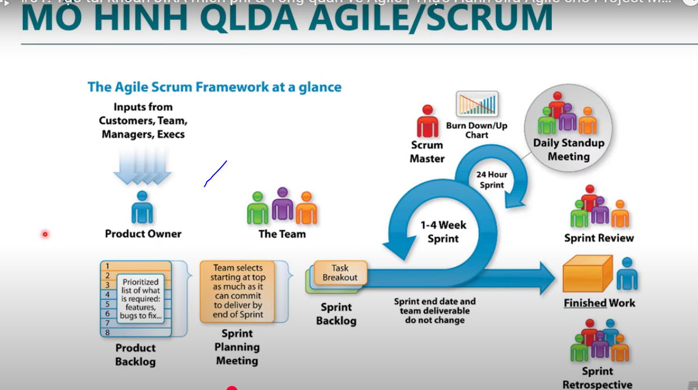

   
  

### **Phần 1: Hướng Dẫn Tạo Tài Khoản Jira Miễn Phí**  
Jira là công cụ quản lý dự án phổ biến trong lĩnh vực CNTT. Dưới đây là các bước đăng ký tài khoản miễn phí:  

**Bước 1: Truy cập trang Atlassian**  
- Vào [https://www.atlassian.com](https://www.atlassian.com), chọn **Sign Up** > **Email** (sử dụng Gmail, Outlook,...).  

**Bước 2: Xác minh email**  
- Kiểm tra hộp thư, nhấp **Verify your email** trong mail từ Atlassian để kích hoạt tài khoản.  

**Bước 3: Thiết lập Jira Software**  
- Đăng nhập > Chọn **Jira Software** > **Get it Free**.  
- Chọn **Scrum** làm template quản lý dự án.  

**Bước 4: Tạo Project**  
- Đặt tên project (VD: "Website Development").  
- Lựa chọn:  
  - **Team-managed**: Dành cho nhóm tự quản lý.  
  - **Company-managed**: Quản lý nhiều sprint song song (khuyên dùng).  
- Skip bước kết nối công cụ khác (nếu chưa cần).  

**Bước 5: Mời thành viên (Optional)**  
- Thêm email đồng nghiệp để cùng làm việc trên project.  

**Lưu ý**:  
- Jira Cloud Free hỗ trợ tối đa 10 người dùng.  
- Khám phá các tính năng như Backlog, Sprint, Roadmap trong giao diện.  

---

### **Phần 2: Tổng Quan Về Mô Hình Scrum vs. Waterfall**  
 
#### **1. Mô Hình Waterfall (Thác Nước)**  
- **Đặc điểm**:  
  - Tuần tự 5 giai đoạn: *Requirement → Design → Implementation → Verification → Maintenance*.  
  - Chỉ bàn giao sản phẩm cuối dự án.  
- **Ưu điểm**:  
  - Rõ ràng, dễ lập kế hoạch ngân sách và timeline.  
- **Nhược điểm**:  
  - Khó thay đổi yêu cầu giữa chừng.  
  - Khách hàng phải đợi lâu để thấy sản phẩm.  

#### **2. Mô Hình Scrum**  
- **Đặc điểm**:  
  - Chia dự án thành các **Sprint** (1–4 tuần), bàn giao sản phẩm từng phần.  
  - **Vai trò chính**:  
    - **Product Owner**: Định hướng sản phẩm.  
    - **Scrum Master**: Hỗ trợ team loại bỏ rào cản.  
    - **Development Team**: Thực hiện công việc.  
  - **Sự kiện**:  
    - **Daily Standup**: Cập nhật tiến độ hàng ngày.  
    - **Sprint Review**: Demo sản phẩm cuối Sprint.  
    - **Retrospective**: Cải tiến quy trình sau mỗi Sprint.  

- **Ưu điểm**:  
  - Linh hoạt thay đổi yêu cầu.  
  - Khách hàng nhận phản hồi sớm, giảm rủi ro.  

---

