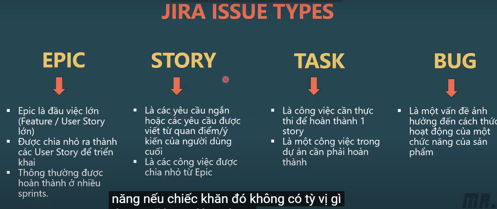
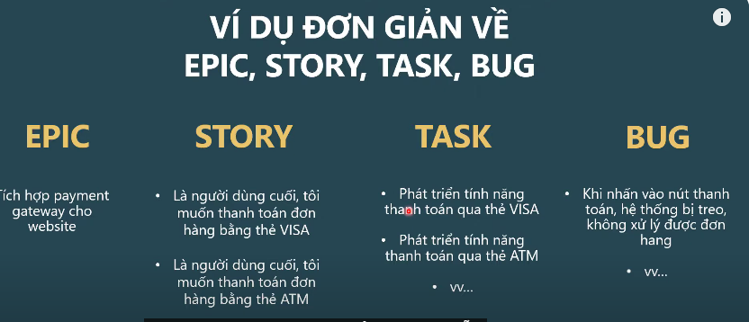

## Tại Sao Cần Hiểu Về Style Trong Dự Án?
Style giúp chúng ta có thể tổ chức và quản lý dự án một cách hiệu quả hơn. Nếu không có hệ thống style, việc kiểm soát và theo dõi tiến độ công việc sẽ trở nên khó khăn. Để hiểu rõ hơn, hãy cùng xem xét một ví dụ thực tế về cây gia phả:
- Nếu bạn có một gia phả được sắp xếp rõ ràng, bạn có thể dễ dàng biết cách xưng hô với từng thành viên trong dòng họ.
- Ngược lại, nếu không có hệ thống này, bạn sẽ gặp khó khăn trong việc xác định mối quan hệ giữa các thành viên.

Trong quản lý dự án, các style giúp chúng ta tổ chức công việc theo cấp độ và mức độ ưu tiên, đảm bảo mọi người trong nhóm đều hiểu rõ nhiệm vụ của mình.

## Các Loại Style Trong Quản Lý Dự Án
Dưới đây là bốn loại style phổ biến:

### 1. **Epic**
Epic là một tập hợp các yêu cầu lớn trong dự án. Mỗi Epic có thể được chia nhỏ thành nhiều user stories hoặc tasks cụ thể để dễ quản lý hơn.

Ví dụ:
- "Phát triển hệ thống thanh toán trực tuyến" có thể là một Epic lớn trong dự án thương mại điện tử.

### 2. **Story (User Story)**
User Story là các yêu cầu chức năng được viết từ góc nhìn của người dùng. Một Epic có thể bao gồm nhiều User Story.

Ví dụ:
- "Người dùng muốn thanh toán đơn hàng bằng thẻ Visa."
- "Người dùng muốn thanh toán đơn hàng bằng thẻ ATM."

### 3. **Task**
Task là các công việc nhỏ hơn được phân chia từ User Story. Đây là những nhiệm vụ cụ thể mà nhóm phát triển cần thực hiện để hoàn thành một Story.

Ví dụ:
- "Tích hợp API thanh toán của Visa vào hệ thống."
- "Kiểm tra tính năng thanh toán bằng thẻ ATM."

### 4. **Bug**
Bug là lỗi hoặc sự cố xảy ra trong quá trình phát triển hoặc vận hành hệ thống. Việc phát hiện và sửa bug giúp đảm bảo phần mềm hoạt động ổn định.

Ví dụ:
- "Nhấn nút thanh toán nhưng không chuyển hướng đến trang xác nhận."
- "Lỗi hiển thị số dư tài khoản sau khi thanh toán."

## Cách Sắp Xếp Và Quản Lý Các Style Trong Dự Án
1. **Chia nhỏ công việc**: Từ Epic, chia thành các User Story, sau đó thành các Task cụ thể.
2. **Gán nhiệm vụ cho từng thành viên**: Đảm bảo mỗi task được giao đúng người có chuyên môn.
3. **Theo dõi tiến độ**: Sử dụng công cụ quản lý như Jira, Trello để kiểm soát trạng thái công việc.
4. **Kiểm tra và sửa lỗi**: Mỗi bug cần được ghi nhận và xử lý kịp thời để tránh ảnh hưởng đến người dùng.

## Kết Luận
Hiểu rõ về các loại style như Epic, Story, Task và Bug giúp bạn quản lý dự án hiệu quả hơn. Hy vọng bài viết này giúp bạn có cái nhìn tổng quan về cách tổ chức và phân bổ công việc trong dự án.

